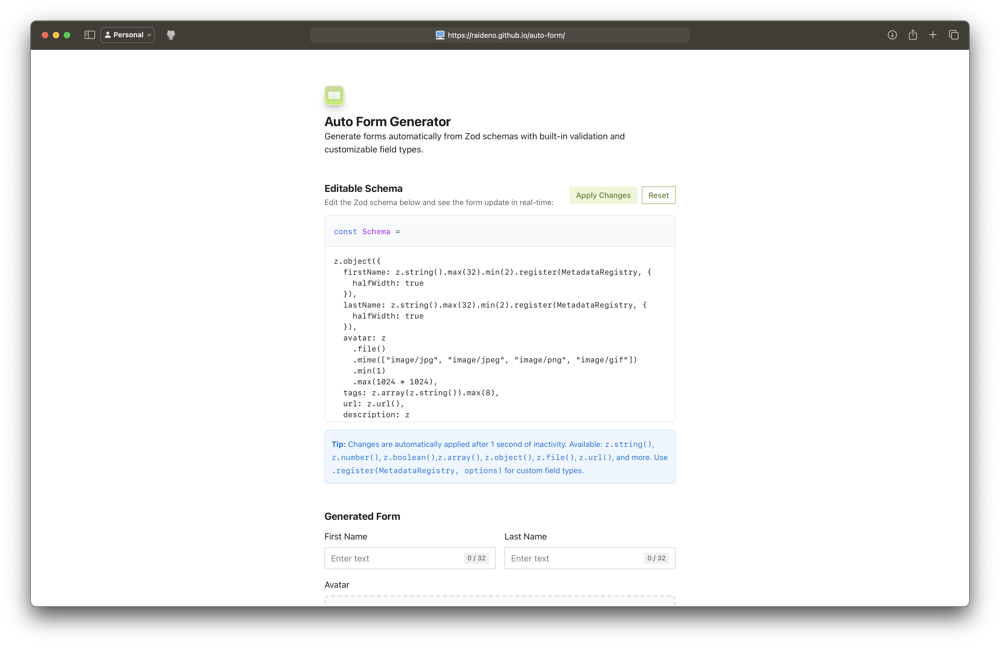

# Auto Form

A React component library that automatically generates forms from Zod schemas with built-in validation and customizable field types.



## Requirements

- Zod v4
- React 18+

## Features

- Automatic form generation from Zod schemas
- Built-in validation using React Hook Form
- Support for various field types: strings, numbers, files, arrays, objects
- Real-time schema editing and form preview
- TypeScript support

## Usage

### Basic Example

```tsx
import { z } from "zod/v4";

import { AutoForm } from "./components/auto-form";
import { MetadataRegistry } from "./components/auto-form/registry";

const Schema = z.object({
  name: z.string().min(2).max(50),
  email: z.string().email(),
  age: z.number().min(18).max(120),
  description: z.string().register(MetadataRegistry, { 
    type: "textarea", 
    resize: true 
  }),
});

function MyForm() {
  return (
    <AutoForm.Root
        schema={Schema}
        onSubmit={(data) => { console.log("[submit]", data) }}
    >
      <AutoForm.Content />
      <AutoForm.Actions>
        <AutoForm.Action type="reset">Cancel</AutoForm.Action>
        <AutoForm.Action type="submit">Submit</AutoForm.Action>
      </AutoForm.Actions>
    </AutoForm.Root>
  );
}
```

### Supported Field Types

- **String**: Text inputs with validation
- **Number**: Numeric inputs with min/max constraints
- **Boolean**: Checkbox inputs
- **File**: File upload with mime type and size validation
- **Array**: Dynamic list inputs for strings and files
- **URL**: URL validation

## Development

```bash
npm install
npm run dev
npm run build
npm run preview
```
